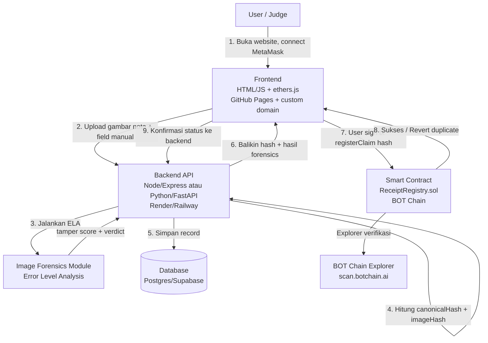

# Architecture

## 1. Diagram Tingkat Tinggi



## 2. Tanggung Jawab per Komponen

### Frontend (temen lo)
- UI upload nota + form field manual.
- Connect wallet (MetaMask) via ethers.js, validasi `chainId` = BOT Chain.
- Panggil backend API untuk analisis (`/api/analyze-receipt`).
- Tampilkan hasil forensics (score, verdict) ke user sebelum submit.
- Panggil contract `registerClaim(hash, metadataURI)` langsung dari wallet user.
- Tangani revert error dari contract, tampilkan detail klaim pertama (`checkClaim`).
- Tampilkan riwayat klaim (dari `/api/receipts?wallet=...`).
- Pasang branding BOT Chain di footer (logo/nama + link botchain.ai & explorer) — **wajib untuk poin submission**.

### Backend (Ghif)
- Endpoint upload + validasi file.
- Modul ELA (image forensics) — murni logic, tidak butuh training model.
- Normalisasi data & hashing (`canonicalHash`, `imageHash`) sesuai `rules.md`.
- Simpan & baca record dari database.
- Tidak pernah menyentuh private key / submit transaksi.

### Smart Contract
- Source of truth untuk status "sudah diklaim atau belum".
- Deploy manual via Remix ke testnet dulu, lalu mainnet (ikuti Day 1 Guide panitia).
- Immutable setelah deploy — jangan terburu-buru deploy ke mainnet sebelum logic testnet fix.

### Database
- Bukan source of truth untuk status klaim (itu tugas contract), tapi menyimpan:
  - Riwayat & audit trail (termasuk hasil forensics yang tidak masuk on-chain).
  - Metadata yang terlalu mahal/tidak perlu disimpan on-chain (gambar, field detail nota).

## 3. Prinsip Desain

1. **Contract sebagai satu-satunya source of truth untuk duplikasi.** DB boleh out of sync, tapi contract tidak pernah bohong.
2. **User selalu menandatangani transaksinya sendiri.** Ini yang bikin demo ke judges valid — mereka connect wallet MEREKA, bukan wallet backend.
3. **Backend stateless terhadap blockchain** — backend cuma *read* dari chain (kalau perlu, via `checkClaim` view function), tidak pernah *write*.
4. **Semua modul dipisah supaya bisa dites independen:** forensics module bisa ditest tanpa contract, contract bisa ditest di Remix tanpa backend nyala, frontend bisa dites dengan hash dummy tanpa nunggu backend selesai — penting biar kerja paralel sama temen lo tidak saling blocking.

## 4. Deployment Topology

```
[GitHub Pages + custom domain] ---- static frontend
            |
            | HTTPS (fetch API)
            v
[Render/Railway backend] ---- Express/FastAPI + ELA module
            |
            | Postgres connection
            v
[Supabase/Render Postgres]

[MetaMask wallet] --(direct RPC, tanpa lewat backend)--> [BOT Chain RPC] --> [ReceiptRegistry.sol]
```
